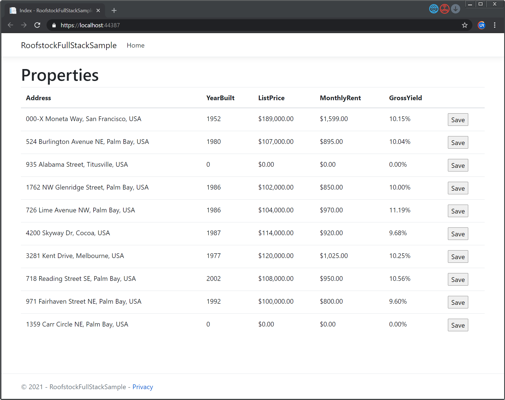

# Roofstock FullStack Sample
ASP.Net Core MVC application that fetch data from API endpoint and save into local database.

The project gets the data from a specific endpoint and maps (with Automapper) into a flat DTO in order to show in the browser. In the browser UI, the user is able to save the record into database. 
When the user writes the record, the database is first searched, if the record does not exist, it is saved and a successful message is sent. Otherwise, if the record already exists, a message is sent indicating it.

**Technologies used**: ASP.Net Core 3.1 (MVC), Entity Framework Core, AutoMapper and SQL Server 2019.

## Database creation
In order to use this demo, create a local SQL Server database (SQLExpress or better). Then, create this table:

```sql
SET ANSI_NULLS ON
GO
SET QUOTED_IDENTIFIER ON
GO
CREATE TABLE [Properties](
	[Id] [int] NOT NULL,
	[Address] [nvarchar](250) NULL,
	[YearBuilt] [int] NULL,
	[ListPrice] [decimal](10, 2) NULL,
	[MonthlyRent] [decimal](10, 2) NULL,
	[GrossYield] [decimal](6, 4) NULL,
 CONSTRAINT [PK_Properties] PRIMARY KEY CLUSTERED 
(
	[Id] ASC
)WITH (PAD_INDEX = OFF, STATISTICS_NORECOMPUTE = OFF, IGNORE_DUP_KEY = OFF, ALLOW_ROW_LOCKS = ON, ALLOW_PAGE_LOCKS = ON) ON [PRIMARY]
) ON [PRIMARY]
GO
```

## Connection string
Update the connection string **"cs01"** in **appsetings.json** file. Target to your local database and set the user and password required.

```json
{
  "Logging": {
    "LogLevel": {
      "Default": "Information",
      "Microsoft": "Warning",
      "Microsoft.Hosting.Lifetime": "Information"
    }
  },
  "AllowedHosts": "*",
  "ConnectionStrings": {
    "cs01": "Data Source=.\\SQLSERVER;Initial Catalog=RoofstockFullStackSample;User ID=sa;Password=Passw0rd;"
  }
}
```

## Run and execute
Compile the solution and RUN in Visual Studio 2019.


## Credits
Created by Eduardo (eriveraa@gmail.com)

